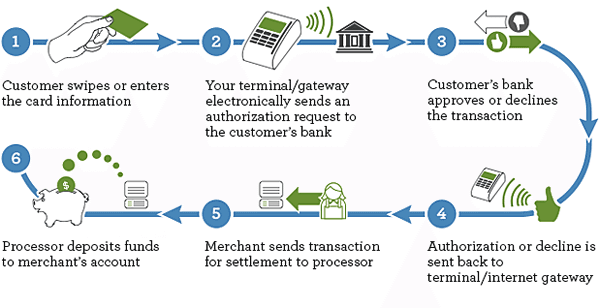
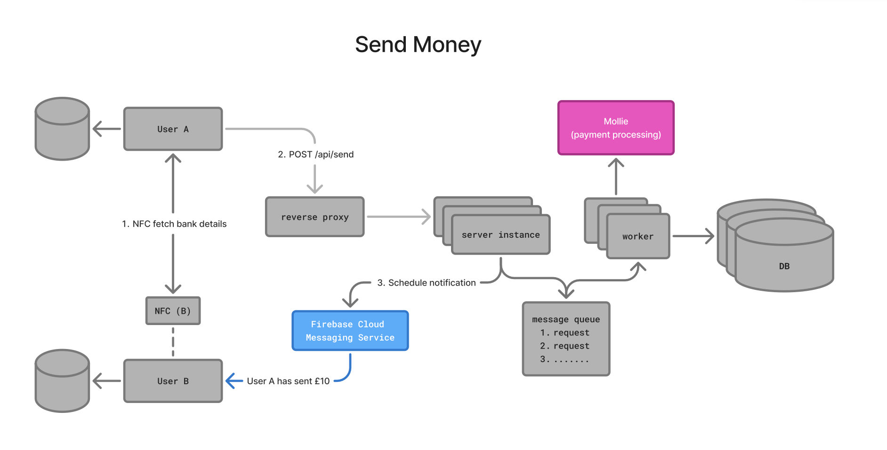
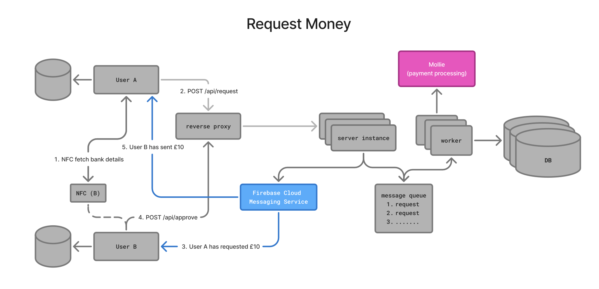

### **NFC-Powered Peer-to-Peer Payment Settlements**

**Problem:**
Casual debts among friends (like rounds at the pub) often go unpaid because there’s no frictionless, fee-free way to settle them. Existing contactless payment systems rely on acquiring banks, introducing fees and unnecessary intermediaries.

**Goal:**
Make casual debt settlement intuitive, fee-free, and as easy as tapping a sticker.

**Solution:**
A peer-to-peer payment system that uses NFC to initiate bank-to-bank transfers therefore directly—bypassing acquiring banks. It functions like a physical interface for debt settlement, combining the simplicity of tap-to-pay with the delayed-settlement flexibility of Splitwise.

**How it works:**
- When users register in-app, an sticky NFC tag is automatically sent to their address.
- Users link a payment method (e.g. Apple Pay, Google Pay, PayPal) as well as an account to receive money into.
* Either party can initiate or request a payment by scanning the other’s NFC tag, entering the amount, and approving the transaction.

**Limitations:**
* Don't have access to physical NFCs so today I hacked my nicorette spray's NFC tag for the purpose of this demo.
- We simulate notifications because we didn't have time to integrate with a notification service (APNs/FCM).

**Example Scenarios:**
1. A taps B’s NFC, sends £10.
2. B scans A’s NFC, requests £10

**How do we integrate our sponsors' tech stacks?:**
* Google Cloud infrastructure
* Mollie for payment processing

**Revenue Streams:**
* Money that remains deposited through 'pay later' earns interest

